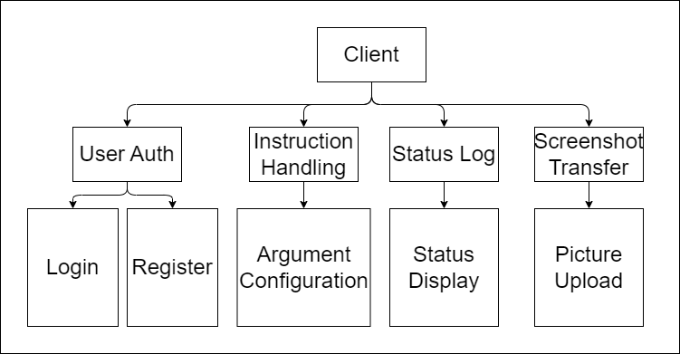

# eMonitor Client

Client for eMonitor, a web-based screen-monitoring system.

## How to build

```bash
# install dependencies
npm install

# prebuild web-pages 
npm run build

# build executable
npm run build:win # for windows
npm run build:mac # for mac
npm run build:linux # for linux
```

## Modular Design



- User Auth
  - Use short websocket connection to authenticate user
  - SubModule
    - Login
      - Authenticate user and build long-lived websocket connection
    - Register
      - Register new user on server
- Websocket Daemon
  - Maintain long-lived websocket connection to communicate with server
  - SubModule
    - Instruction Handler
      - Configure settings for uploader
    - Status Logger
      - Cache current network status and screen shot
    - Screenshot Uploader
      - Compress screen shot
      - Encrypt screen shot
      - Upload to server
